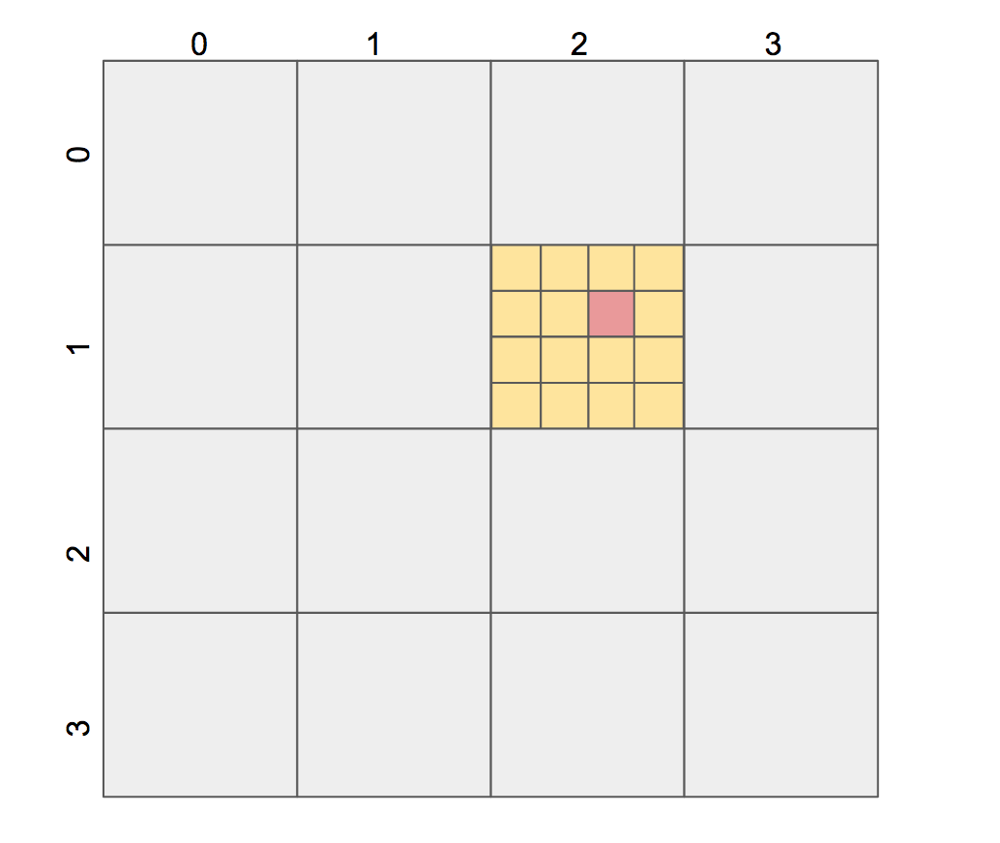
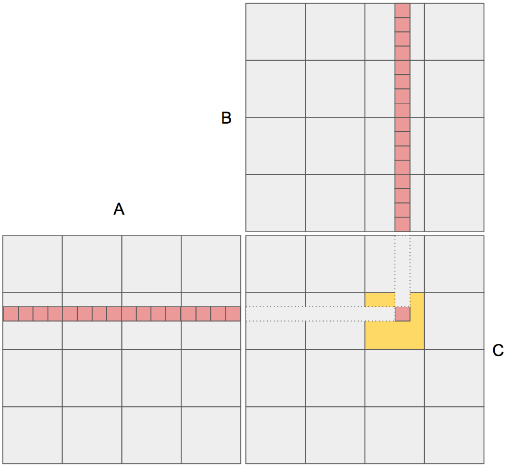
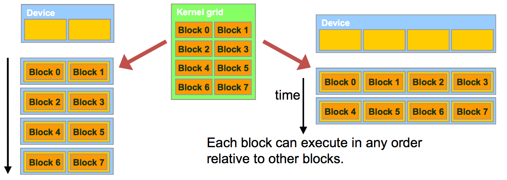
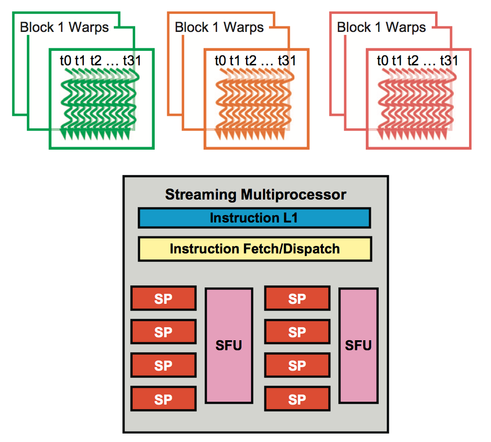

# Data-Parallel Execution Model

We'll be delving into the details of the organization, resource assignment, synchronization, and scheduling of threads in a grid.

## CUDA Thread Organization

All CUDA threads in a grid execute the same kernel function and they rely on special variables to distinguish themselves from each other and to identify the appropriate portion of the data to process. Think of the kernel function as specifying the C statements that are executed by each individual thread at runtime.

All threads in a block share the same block index, accessed via `blockIdx`. Additionally, each thread in a block has a unique index, accessed via `threadIdx`. Thus, inside this two-level hierarchy, a thread has a tuple of unique coordinates `(blockIdx, threadIdx)`. The execution configuration parameters (ECPs) in a kernel launch specify the grid size `gridDim` (i.e. the number of blocks in a grid) and the block size `blockDim` (i.e. the number of threads in a block).

In general, a grid is a 3D array of blocks, and each block is a 3D array of threads. We can choose to use fewer dimensions by setting unused dimensions to 1. At kernel launch, we specify 2 parameters enclosed within triple signs `<<<param1, param2>>>`. The first ECP specifies the dimensions of the grid in number of blocks. The second ECP specifies the dimensions of each block in number of threads. Each such parameter is of type `dim3`, which is a C struct with three unsigned integer fields: `x`, `y`, and `z`.

For 1D and 2D grids and blocks, the unused dimensions should be set to 1 for clarity. However, for convenience, CUDA C lets us use plain variables or direct mathematical expressions to specify ECPs for 1D grids. For example, suppose we would like to launch our vector addition kernel `vecAdd` with a set number of threads per block equal to 256. In this way, the number of blocks (i.e. gridDim) will vary with the size of the input vectors so that the grid will have enough threads to cover all vector elements. We can do this in 2 ways:

```c
// method 1
int threadsPerBlock = 256;
dim3 gridDim(ceil(n / (float)threadsPerBlock), 1, 1);
dim3 blockDim(threadsPerBlock, 1, 1);
vecAdd<<<gridDim, blockDim>>>(...);

// method 2
int threadsPerBlock = 256;
int blocksPerGrid = ceil(n / (float)threadsPerBlock);
vecAdd<<<blocksPerGrid, threadsPerBlock>>>(...);
```
Obviously, hardware constraints impose limits on the dimensions of the grid and the blocks. They are:

- `gridDim`: each dimension can vary between 1 and 65,536 (this number will vary with newer GPUs).
- `blockDim`: maximum of 1,024 threads, i.e the product of all dimensions cannot exceed 1,024.
    - allowed ex: `(512, 1, 1)`, `(8, 16, 4)`, `(32, 16, 2)`
    - illegel ex: `(32, 32, 2)`

## Mapping Threads to Multidimensional Data

The choice of 1D, 2D, or 3D thread organizations is usually based on the nature of the data. For example, grayscale images are a 2D array of pixels `(H, W)` while RGB images are a 3D array of pixels `(H, W, C)`.

It is often convenient to use a 2D grid that consists of 2D blocks to process the pixels in a picture. For example, consider an image of size `76x62`. Assume that we decided to use a `16x16` block, with 16 threads in the x direction and 16 threads in the y direction. To process such an image, we would need `ceil(76  / 16) = 5` blocks in the x dimension and `ceil(62 / 16) = 4` blocks in the y dimension. This results in `5*4=20` blocks for a total of `20*16*16=5,120` threads. However, there are only 4,712 pixels in the image, so we would have an if statement to disable the extra threads from doing work.

Here's some code to launch a kernel to process an image of height `H` and width `W`. Note that the number of rows corresponds to the height (the y direction) and that the number of columns corresponds to the width (the x direction). In this example, we assume for simplicity that the dimensions of the blocks are fixed at `16x16`.

```c
dim3 dimBlock(ceil(W/16.0), ceil(H/16.0), 1);
dim3 dimGrid(16, 16, 1);
processImg<<<dimGrid, dimBlock>>>(...);
```
Now that we've seen how to map the 2D grids and threads to the image, let's write a kernel that scales each value in an image by 2. First, let's examine how we can compute the global coordinates of the pink thread in the grid below.

<p align="center">
 
</p>

The row of this tread can be calculated using the y dimension and the column can be calculate using the x dimension. The pink thread is located in `row=1, col=2`.

- `row`: We've consumed 4 threads since we're in row 1 plus an extra 1 since we're at row 1 inside the block. Thus the index of the row is `4+1=5`. Generalizing from this example, we can write `row = (blockIdx.y * blockDim.y) + threadIdx.y`.
- `col`: We've consumed `4*2=8` threads since we're in col 2 plus an extra 2 since we're at col 2 inside the block. The the index of the col is `8+2=10`. Generalizing from this example, we can write `col = (blockIdx.x * blockDim.x) + threadIdx.x`.

Once the global coordinates of a thread within a grid are obtained, we linearize them to access the flattened data elements in row-major format. Thus, our image scaling kernel can now be completed:

```c
__global__ void imgScaler(float* imgIn, float* imgOut, int H, int W) {
    // compute global thread coordinates
    int row = (blockIdx.y * blockDim.y) + threadIdx.y;
    int col = (blockIdx.x * blockDim.x) + threadIdx.x;

    // flatten coordinates
    int offset = row * W + col;

    if ((row < H) && (col < W)) {
        imgOut[offset] = 2 * imgIn[offset];
    }
}
```
How would things have changed had we used a different set of ECPs? Suppose we had fixed the number of threads in a block to be 256 in 1 dimension. Then, we would have had 1D blocks within a 2D grid `dim3 dimBlock(ceil(W/256.0), ceil(H/256.0), 1)`. The `col` global coordinate would have stayed the same, but `row` would have collapsed to `blockIdx.y`. We don't even have to instantiate a 2D grid. We could have had `dimBlock = 256` and `dimGrid = ceil((H * W) / 256.0)`. Then, the offset would be exactly as in our vector example `offset = blockIdx.x * blockDim.x + threadIdx.x`. This shows you how manipulating the ECPs can lead to different indexing in the kernel.

The code above assumed the image was grayscale. If we instead work with RGB images, then the pixel values are stored in consecutive triplets (r, g, b) although this order may differ depending on the library used to load the image. With three values where previously there was 1, consecutive thread indices are now separated by 2 pixels. This means that we should account for triplet data elements by multiplying the offset by 3. Our code, where each thread works on 3 consecutive pixels, becomes:

```c
// C = 3 if rgb else 1
__global__ void imgScaler(float* imgIn, float* imgOut, int H, int W, int C) {
    // compute global thread coordinates
    int row = (blockIdx.y * blockDim.y) + threadIdx.y;
    int col = (blockIdx.x * blockDim.x) + threadIdx.x;

    // flatten coordinates
    int offset = (row * W + col) * C;

    if ((row < H) && (col < W)) {
        imgOut[offset] = 2 * imgIn[offset];
        imgOut[offset + 1] = 2 * imgIn[offset + 1];
        imgOut[offset + 2] = 2 * imgIn[offset + 2];
    }
}
```

## Matrix-Matrix Multiplication

In this section, we'll be focusing on the multiplication of square matrices. Suppose we are multiplying A and B and storing the result in C, i.e. `C = A*B`. When performing the multiplication, element (i, j) of C corresponds to the dot product of row i of A and col j of B.

<p align="center">
 
</p>

As in our `imgScaler()` kernel, we need to map each thread of our grid to a single element of the output matrix C. With this thread-to-data mapping, we effectively divide our matrix C into square tiles, each tile being the size of a block. Inside each block, a thread is responsible for 1 element in C, but unlike `imgScaler()`, each thread is working on multiple elements from the input matrices A and B. Thus, we're going to see a `for` loop in the kernel. Let's go ahead and write it.

```c
__global__ void matrixMultiply(float* A, float* B, float* C, int M) {
    int row = blockIdx.y * blockDim.y + threadIdx.y;
    int col = blockIdx.x * blockDim.x + threadIdx.x;

    if ((row < M) && (col < M)) {
        float cumSum = 0;
        for (int k = 0; k < M; k++) {
            cumSum += A[row*M + k] * B[k*M + col];
        }
        C[row*M + col] = cumSum;
    }
}
```
How exactly did we compute the indices of A and B? Well, recall that each thread needs to perform a dot product with a row from A and a
column from B. To perform this dot product, we initialize a variable `cumSum` before the for loop. Then at each loop iteration, we access an element from the row of A, an element from the column of B, multiply the 2 together, and accumulate the result in `cumSum`.

- To access a row element from A, we first need to account for all the rows before us since A is linearized into an equivalent 1D array where the rows are placed one after another in the memory space (column-major). For example, the beginning element of row 1 is accessed using index `1*M` where `M` is the size of the square matrix. In general, the beginning element of row `row` is accessed using index `row*M`. To get the k'th element in that row, we just add k to obtain `row*M + k`.
- To access a column element from B, we need to realize that the k'th element of column i is located at the i'th element at row k. Accessing the next element in the column requires skipping exactly an entire row, because the next element in the column corresponds to the same element in the next row. Thus, we obtain the index `k*M + col`.

## Synchronization and Transparent Scalability

In this part, we discuss how CUDA coordinates the execution of multiple threads. CUDA allows threads in the same block to coordinate their activities using a barrier synchronization function `__syncthreads()`. When a kernel function calls `__syncthreads()`, all threads in a block will be held at the calling location until every thread in the block reaches the location. This ensures that all threads in a block have completed a phase of their execution of the kernel before any of them can move on to the next phase. The uses of this function will be discussed in the next chapter.

Barrier synchronization is a simple and popular method of coordinating parallel activities. In real life, we often use barrier synchronization to coordinate parallel activities of multiple persons. For example, assume that four friends go to a shopping mall in a car. They can all go to different stores to shop for their own clothes. This is a parallel activity and is much more efficient than if they all remain as a group and sequentially visit all the stores of interest. However, barrier synchronization is needed before they leave the mall. They have to wait until all four friends have returned to the car before they can leave: the ones who finish earlier need to wait for those who finish later. Without the barrier synchronization, one or more persons can be left in the mall when the car leaves!

The `__syncthreads()` command is a block level synchronization barrier. This means that when present, it must be executed by all threads in a block. It is also possible to use `__syncthreads()` in conditional code but only when all threads evaluate identically such code otherwise the execution is likely to hang or produce unintended side effects. A block of threads can begin execution only when the runtime system has secured all the resources needed for all threads in the block to complete execution. This ensures the time proximity of all threads in a block and prevents excessive or indefinite waiting time during barrier synchronization.

By not allowing threads in different blocks to perform barrier synchronization with each other, the CUDA runtime system can execute blocks in any order relative to each other since none of them need to wait for each other. This allows *transparent scalability*: the ability to execute the same piece of code with a different number of execution resources.

<p align="center">
 
</p>

For example, in a low-cost system with only a few execution resources, one can execute a small number of blocks at the same time (left). This is slow but incurs a lower power consumption (good for mobile devices). In a high-end implementation with more execution resources, one can execute a large number of blocks at the same time (right).

## Assigning Resources to Blocks

Once a kernel is launched, the CUDA runtime system generates a grid of threads. These threads are assigned to execution resources on a block-by-block basis. The execution resources are organized into streaming multiprocessors (SMs). An SM contains a bunch of streaming processors (aka cores) which contain 1 FPU and 1 ALU, load/store units, L1 and L2 caches, etc. Multiple thread blocks can be assigned to each SM. For example, a CUDA device may allow up to eight blocks to be assigned to each SM.

In situations where there is an insufficient amount of any one or more types of resources needed for the simultaneous execution of eight blocks, the CUDA runtime automatically reduces the number of blocks assigned to each SM until their combined resource usage falls under the limit. With a limited numbers of SMs and a limited number of blocks that can be assigned to each SM, there is a limit on the number of blocks that can be actively executing in a CUDA device. Most grids contain many more blocks than this number. The runtime system maintains a list of blocks that need to execute and assigns new blocks to SMs as they complete executing the blocks previously assigned to them. One of the SM resource limitations is the number of threads that can be simultaneously tracked and scheduled. It takes hardware resources for SMs to maintain the thread and block indices and track their execution status.

Once a block is assigned to a SM, it is further divided into 32-thread units called **warps**. The warp is the unit of thread scheduling in SMs. Each warp consists of 32 threads of consecutive `threadIdx` values: threads 0-31 from the first warp, 32-63 from the second warp, and so on. In the figure below, there are three blocks: block 1, block 2, and block 3, all assigned to an SM. Each of the three blocks is further divided into warps for scheduling purposes.

<p align="center">
 
</p>

We can calculate the number of warps that reside in an SM for a given block size and a given number of blocks assigned to each SM. If each block has 256 threads, then each block is divided into `256 / 32 = 8` warps. Thus with 3 blocks, there are a total `8 * 3 = 24` warps in the SM (assuming the maximum number of threads per SM is not exceeded).

An SM is designed to execute all threads in a warp following the single instruction, multiple data (SIMD) model. That is, at any instant in time, one instruction is fetched and executed for all threads in the warp. Note that these threads will apply the same instruction to different portions of the data. As a result, all threads in a warp will always have the same execution timing.

In general, there are fewer SPs than the number of threads assigned to each SM. That is, each SM has only enough hardware to execute instructions from a small subset of all threads assigned to the SM at any point in time. In earlier GPU design, each SM can execute only one instruction for a single warp at any given instant. In more recent designs, each SM can execute instructions for a small number of warps at any given point in time. In either case, the hardware can execute instructions for a small subset of all warps in the SM.

So why do we need to have so many warps in an SM if it can only execute a small subset of them at any instant? The answer is that this is how CUDA processors efficiently execute long-latency operations such as global memory accesses. When an instruction executed by the threads in a warp needs to wait for the result of a previously initiated long-latency operation, the warp is not selected for execution. Another resident warp that is no longer waiting for results will be selected for execution. If more than one warp is ready for execution, a priority mechanism is used to select one for execution. This mechanism of filling the latency time of operations with work from other threads is often called **latency tolerance**.

With enough warps around, the hardware will likely find a warp to execute at any point in time, thus making full use of the execution hardware in spite of these long-latency operations. The selection of ready warps for execution does not introduce any idle time into the execution timeline, which is referred to as *zero-overhead thread scheduling*. This ability to tolerate long operation latencies is the main reason why GPUs do not dedicate nearly as much chip area to cache memories and branch prediction mechanisms as CPUs. As a result, GPUs can dedicate more of its chip area to floating- point execution resources.

Lastly, let's do a simple analysis. Assume that a CUDA device allows up to 8 blocks and 1,024 threads per SM, whichever becomes a limitation first. Furthermore, it allows up to 512 threads in each block. Should we use `8x8` blocks or `16x16` for matrix multiplication?

- With `8x8` blocks, there are 64 threads per block. To fully occupy an SM, we would have `1,024/64=12` blocks. But the maximum is 8 blocks per SM so we would have `64x8=512` threads in each SM. We are underutilizing the SM!
- With `16x16` blocks, there are 256 threads per block. To fully occupy an SM, we would have `1,024/256=4` blocks. This is under the limitation so we would have full-thread capacity in each SM.

## Summary

The execution configuration parameters (ECPs) define the dimensions of a grid and its blocks. By using unique coordinates in the `blockIdx` and `threadIdx` variables, we can identify the global coordinates of a thread in a grid and thus the partition of data they should work on.

Once a grid is launched, its blocks are assigned to SMs in arbitrary order. Since blocks can be executed in any order relative to each other, the GPU gives us flexibility or *transparent scalability*. A high-end GPU may execute many blocks at the same time, while a lesser-end one will execute fewer blocks at the same time.

Threads are assigned to SMs for execution on a block-by-block basis. Every GPU has a limitation on the amount of resources available in each SM. For example, each CUDA device has a limit on the number of thread blocks and the number of threads each of its SMs can accomodate, whichever becomes a limitation first.

Once a block is assigned to an SM, it is further divided into warps. All threads in a warp have identical execution timing. At any time, the SM executes instructions of only a small subset of its resident warps. This allows the other warps to wait for long-latency operations without slowing down the overall execution throughput of the massive number of execution units.
