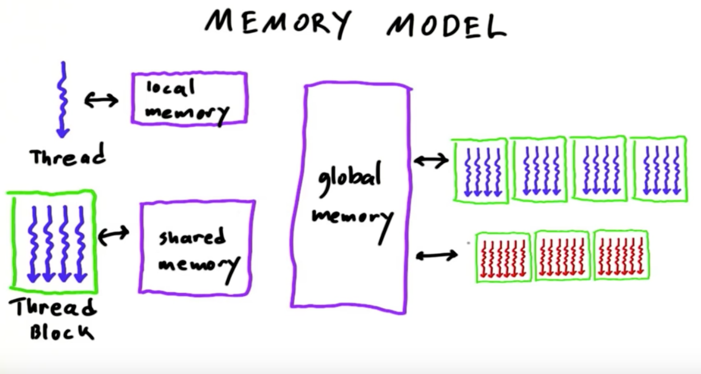
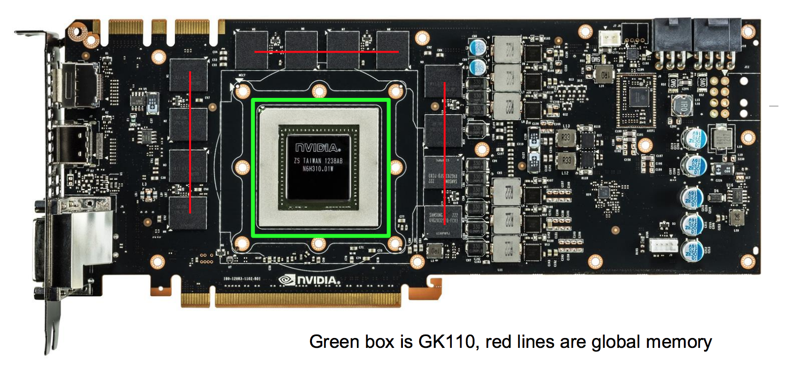

# CUDA Memories

Simple kernels like the ones we've been writing will only achieve minimal speedup. This is because they access their data from global memory, which is typically implemented with dynamic random access memory (DRAM). DRAM tends to have long access latencies and finite access bandwidth, both of which contribute to traffic congestion, ultimately rendering some SMs idle. In this chapter, we'll learn about other memories we can leverage to boost the execution efficiency of our kernels.

## Memory Access Efficiency

An important metric for quantifying the efficiency of a CUDA kernel is the **Compute to Global Memory Access** ratio (CGMA). It is defined as the number of floating-point calculations performed over the number of global memory accesses performed within a region of a CUDA program. For example, in the matrix multiplication kernel we wrote in the previous chapter, the compute-heavy part of our kernel was the inner for-loop which computed the dot product of row i of A and column j of B:

```c
for (int k = 0; k < M; k++) {
    cumSum += A[row*M + k] * B[k*M + col];
}
```
In this for loop, there are 2 FLOPS performed (1 multiplication and 1 addition) for every 2 global memory accesses (1 for A and 1 for B). Thus, `CGMA=1/1=1.0`.

CGMA has major implications on the performance of CUDA kernels. With a global memory bandwidth of 200 GB/s, and a size of 4 bytes per single precision floating-point value, we can expect to load at most `200/4=50` giga operands per second. With a CGMA of 1.0, the matrix multiplication kernel will execute no more than `50*1.0=50` giga flops per second (GFLOPS). This is just a fraction of the capability of current GPUs (1,500 GFLOPS). To achieve peak performance, we'd need a CGMA of `1,500/50=30`!

## Memory Types

CUDA supports several types of memory that can be used by programmers to achieve a high CGMA ratio and thus a high execution speed in their kernels. The below diagram illustrates these memories.

<p align="center">
 
</p>

- global memory and constant memory are *off-chip* memories.
- shared memory and registers are *on-chip* memories.

Variables that reside in on-chip memories can be accessed at very high-speed in a highly-parallel manner while variables that reside in off-chip memories can be accessed with long latencies and relatively small bandwidth. This is due to the fact that register variables require fewer instructions to execute since they do not need to be loaded on chip.

Registers are allocated to individual threads: each thread can only access its own registers. For example, if a kernel declares a variable of which the scope is a thread and it is launched with one million threads, one million versions of the variable will be created so that each thread initializes and uses its own version of the variable.

Shared memory is allocated to thread blocks; all threads in a block can access variables in the shared memory locations allocated to the block. Shared memory is an efficient means for threads to cooperate by sharing their input data and the intermediate results of their work. We'll see later on how several important types of parallel algorithms can greatly benefit shared memory.

Constant memory is shared for all grids, meaning that all threads in all grids see the same version of a constant variable. The lifetime of a constant variable is the entire application execution. Constant variables are often used for variables that provide input values to kernel functions. Constant variables are stored in the global memory but are cached for efficient access.

<p align="center">
 
</p>

## Tiled Matrix Multiplication

So we've taken a look at the different memories that can be leveraged on the GPU. We saw how there is an intrinsic trade-off in the use of device memories in CUDA: global memory is large but slow, whereas the shared memory is small but fast. A common strategy will be to partition the data into subsets called tiles so that each tile fits into the shared memory.

Here's the kernel for tiled matrix multiplication.

```c
__global__ void tiledMatrixMultiply(float* A, float* B, float* C, int width) {
    // allocate 2D block of shared memory
    __shared__ float A_s[TILE_WIDTH][TILE_WIDTH];
    __shared__ float B_s[TILE_WIDTH][TILE_WIDTH];

    // number of phases it will take to calculate
    // the full dot product.
    // this is really just the width of the matrix
    // divided by the tile width.
    float num_iters = ceil(width / TILE_WIDTH);

    // row and column of thread
    // we multiply by TILE_WIDTH rather than blockDim
    // in case our tile width is smaller than the block
    // dimension
    int row = blockIdx.y * TILE_WIDTH + threadIdx.y;
    int col = blockIdx.x * TILE_WIDTH + threadIdx.x;

    float cumSum = 0;
    for (int i = 0; i < num_iters; i++) {
        // linearize row and col for data access
        int offsetA = (row * width) + (i * TILE_WIDTH) + tx;
        int offsetB = width*(i * TILE_WIDTH + ty) + col;

        // load tile value into shared memory
        A_s[threadIdx.y][threadIdx.x] = A[offsetA];
        B_s[threadIdx.y][threadIdx.x] = B[offsetB];
        __syncthreads();

        // accumulate partial dot product
        for (int k=0; k < TILE_WIDTH; k++) {
            cumSum += A_s[threadIdx.y][k] + B_s[k][threadIdx.x];
        }
        __syncthreads();
    }
    // once fully accumulated, set the value in result
    C[row*width + col] = cumSum;
}
```
