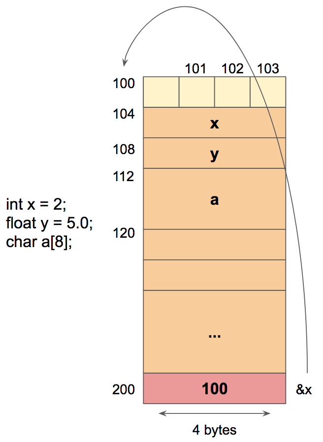
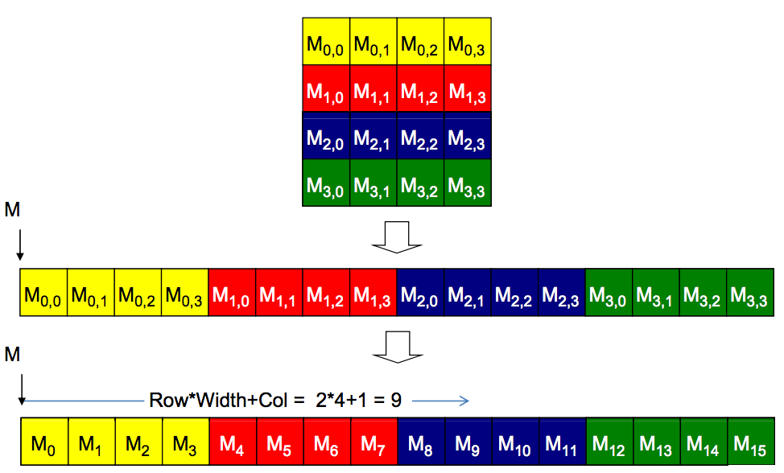
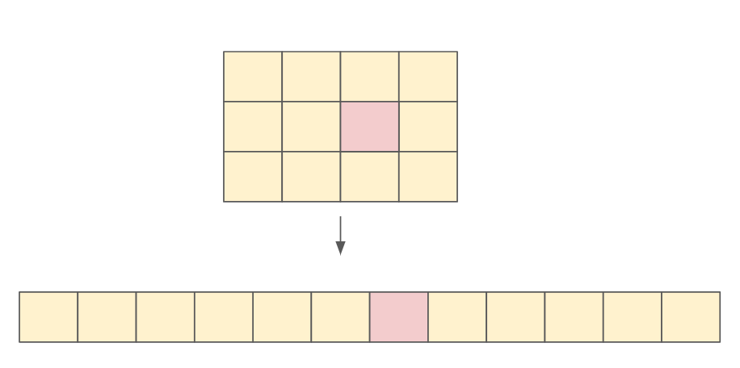

# Memory in C

Memory on your computer is flat: it's just a bunch of contiguous addressable locations accomodating 1 byte of data. Variables that require multiple bytes (4 bytes for float, 8 bytes for double) are stored in consecutive byte locations. They are accessed using the address of the starting byte and the number of bytes needed to access the data value. For example, a float (4 bytes) whose starting address is 10 takes up data at addresses 10, 11, 12 and 13.

<p align="center">
 
</p>

Since memory is flat, multidimensional arrays are actually flattened into 1D arrays. When we use multidimensional syntax (`A[i][j]`) to access an element of a multidimensional array, the compiler linearizes these accesses into a base pointer that points to the beginning element of the array, along with an offset calculated from these multidimensional indices.

There are at least two ways one can linearize a 2D array. One is to place all elements of the same row into consecutive locations. The rows are then placed one after another into the memory space. This arrangement, called row-major layout, is used in C compilers. Another way to linearize a 2D array is to place all elements of the same column into consecutive locations. The columns are then placed one after another into the memory space. This arrangement, called column-major layout, is used by FORTRAN compilers.

<p align="center">
 
</p>

## Offset Calculation for Row-Major Format

Let's see how we can calculate the linearized offset given the third element of the second row in a 3x4 array (`num_rows=3`, `num_cols=4`).

<p align="center">
 
</p>

We note that every time a complete row is traversed, `num_cols` elements are consumed. Anything less than a full row means we've consumed `col_idx` number of elements. Thus, the formula mapping the 2D tuple `(row_idx, col_idx)` to the flattened index in memory is:

```python
offset = (row_idx * num_cols) + col_idx
```