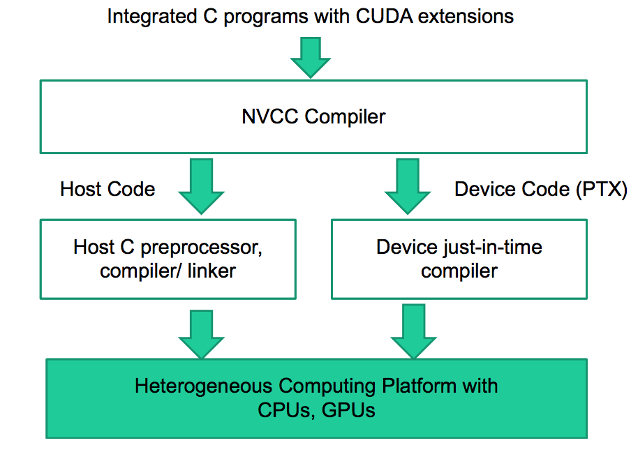
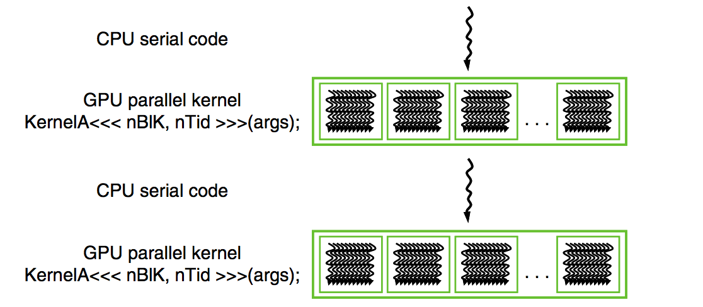
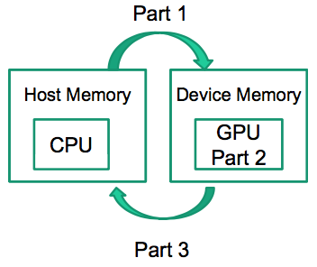

# Data Parallelism and CUDA C

## Program Structure

* **host**: cpu
* **device**: gpu

A CUDA source file can have a mixture of both host and device code. A CUDA program is a traditional C program with added device functions clearly marked by special CUDA keywords. Since we've added these keywords to the source file, we can no longer feed it to a traditional C compiler. Instead, we use a CUDA C compiler by NVIDIA called (NVCC) which processes the CUDA program using the keywords to separate host and device code.

The host code is fed to the host's standard C/C++ compiler and executed as a CPU process. The device code, marked with special keywords to indicate data-parallel functions called *kernels*, is fed to the runtime compiler of NVCC and executed on the GPU.

<p align="center">
 
</p>

The execution of a CUDA program starts with the execution of the host program. When a *kernel* is called or *launched*, it is executed by a large number of threads on the device. All the threads that are generated by a kernel launch are collectively called a grid. When all threads of a kernel complete their execution, the corresponding grid terminates, and the execution continues on the host until another kernel is launched.

<p align="center">
 
</p>

## Vector Addition Kernel

Let's start with a CPU sequential version of vector addition.

```c
// compute vector sum h_C = h_A + h_B
void vecAdd(float* h_A, float* h_B, float* h_C, int n) {
    for (i = 0; i < n; i++) {
        h_C[i] = h_A[i] + h_B[i];
    }
}
int main() {
    // memory allocation for h_A, h_B, h_C

    // initialization of h_A, h_B

    vecAdd(h_A, h_B, h_C, N); 
}
```
Note the convention of prefixing the names of variables that are processed by the host with `h_` and those of variables that are processed by the device with `d_`.

The steps to modify `vecAdd` such that it can run on the device are:

* allocate host vectors + initialize them
* allocate device memory for A, B, C
* copy A and B to device memory
* kernel launch
* copy C from the device memory to the host memory
* free up resources on device and possibly on host

## Global Memory and Data Transfer

The host and the device have separate memory spaces. The device memory is referred to as the global memory. It consists in DRAM. To execute a kernel on the device, we need to allocate global memory on the device and transfer data from the host memory to the allocated device memory. Similarly, after the kernel terminates, we needs to transfer result data from the device memory back to the host memory and free up the device memory that is no longer needed.

<p align="center">
 
</p>

CUDA gives us API functions that perform these things for us. Let's look into them:

* `cudaMalloc()`: called from the host code to allocate a piece of device global memory for an object.
    * **address**: address of a pointer to allocated object. Should be cast to `void **`.
    * **size**: size of allocated object in terms of bytes
* `cudaFree()`: frees object from device global memory
    * **pointer**: pointer to the freed object.
* `cudaMemcpy()`: memory data transfer
    * **dest**: pointer to destination
    * **src**: pointer to source
    * **size**: number of bytes copied
    * **dir**: type/direction of copy.

Here's an example of how we use each in the `vecAdd()` method of the earlier section:

```c
float *d_A = NULL;
int size = n * sizeof(float);

cudaMalloc((void **) &d_A, size);
cudaMemcpy(d_A, A, size, cudaMemcpyHostToDevice);
cudaFree(d_A)
```
So we have the tools to code all the steps mentioned in section 2 except for the kernel invocation. Let's go ahead and code them up.

```c
void vecAdd(float* A, float* B, float* C, int n)
{
    // params
    int size = n * sizeof(float);
    float *d_A, *d_B, *d_C;

    // allocate host vectors
    cudaMalloc((void **) &d_A, size);
    cudaMalloc((void **) &B_d, size);
    cudaMalloc((void **) &d_C, size);

    // possible initialization

    // copy A and B to device memory
    cudaMemcpy(d_A, A, size, cudaMemcpyHostToDevice);
    cudaMemcpy(d_B, B, size, cudaMemcpyHostToDevice);

    // kernel invocation code

    // copy C from device to host
    cudaMemcpy(C, d_C, size, cudaMemcpyDeviceToHost);

    // free up resources
    cudaFree(d_Ad); cudaFree(d_B); cudaFree (d_C);
}
```

## Kernel Functions and Threading

In CUDA, a kernel function specifies the code to be executed by **all threads** during a parallel phase. All the threads are executing the same code, so it is an instance of SPMD (single program, multiple data) programming. This means that we're essentially getting rid of the sequential `for` loop that would have been needed on the CPU.

When a host launches a kernel, the CUDA runtime system generates a grid of threads, with all threads executing the same kernel code.

* each grid is organized into an array of thread blocks
* each block is of the same size, and can contain a maximum of 1024 threads

<p align="center">
 
</p>

The number of threads in each thread block is specified by the host code when a kernel is launched. This means that the same kernel can be launched with different number of threads at different parts of the host code. 

The number of threads in a block can be accessed via the `blockDim` variable in the specific dimension. For a 1D grid, we'd access it using `blockDim.x`. Each thread in a block has a unique `threadIdx` value. By combining `threadIdx` and `blockDim`, we can create a global index for a thread in the entire grid.

```c
i = blockIdx.x * blockDim.x + threadIdx.x
```

> In general, the dimensions of thread blocks should be multiples of 32 due to hardware efficiency reasons.

Given what we've just learned, let's write a simple kernel for adding 2 vectors:

```c
__global__
void vector_add(float* A, float* B, float* C, int n) {
    int i = threadIdx.x + blockDim.x * blockIdx.x;
    if (i < n) C[i] = A[i] + B[i];
}
```

We preface the function with a CUDA specific keyword `__global__`, indicating to the compiler that this function is a kernel and that it should be called by the host to generate a grid of threads on the device. There are 3 qualifier keywords that can come before function declarations:

| Keyword       | Executed by   |   Callable from  |
| ------------- |:-------------:| ----------------:|
| `__device__`  | device        |  device          |
| `__global__`  | device        |  host            |
| `__host__`    | host          |  host            |

You'll notice the `__host__` keyword. A host function is simply a traditional C function that executes on the host and can only be called from another host function. By default, all functions in a CUDA program are host functions if there is no keyword in their declaration.

Next, we defined the index `i` using three keywords: `threadIdx.x`, `blockIdx.x` and `blockDim.x`. Since all threads execute the same kernel code, we need to distinguish among them and direct each towards a particular part of the input data. Different threads will see different values in these three variables. Note that the `.x` implies that there might be `.y` and `.z` which we'll cover in a future section. The index `i` is an automatic variable, private to each thread. A version of i will be generated for each thread, meaning if we have 10,000 threads, there will be 10,000 versions of i.

Finally, since not all vector lengths can be expressed as multiples of the block size, we use `if (i < n)` to disable the extra threads in the last block.

How do we launch the kernel we just wrote? We do so by specifying **execution configuration parameters**. The first configuration parameter gives the number of thread blocks in the grid. The second specifies the number of threads in each thread block. Suppose we set the number of threads in a block to 256, i.e. `dimBlock = 256`. To ensure that we have enough threads to cover all the vector elements, we apply the C ceiling function to `n/256.0`. Using floating-point value 256.0 ensures that we generate a floating value for the division so that the ceiling function can round it up correctly. For example, if we have 1,000 threads, we would launch `ceil(1,000/256.0) = 4` thread blocks. As a result, the statement will launch `4*256=1024` threads. With the `if (i < n)` statement in the kernel, only the first 1,000 threads will perform addition on the 1,000 vector elements whilst the remaining 24 stay idle.

```c
// kernel launch
vector_add<<<ceil(n/256.0), 256>>>(d_A, d_B, d_C, n);
```

## Performance Note

This vector addition example will probably be slower on the GPU than on the CPU. The reason is that the overhead of allocating device memory, input data transfer from host to device, output data transfer from device to host, and de-allocating device memory is expensive. In fact, the amount of calculation done by the kernel is `1 FLOPS / 3 MEM`, i.e. one addition is performed for two floating-point input operands and one floating-point output operand.

## Summary

**Function Declarations.** CUDA extends the C syntax to support heterogeneous computing. Using 3 keywords, `__global__`, `__device__`, `__host__`, one can instruct the compiler to generate a kernel function, a device function or a host function respectively. If there is no keyword before a function declaration, it is defaulted to a host function.

**Kernel Launch.** CUDA extends C function call syntax with kernel execution configuration parameters surrounded by `<<<` and `>>>`. 2 parameters need to be specified: the number of blocks in a grid, and the number of threads in a block (i.e. `dimGrid` and `dimBlock`).

**Predefined Variables.** CUDA kernels can access a set of predefined variables that allow each thread to distinguish among themselves and to determine the area of data each thread is to work on. We saw 3 variables: `threadIdx`, `blockIdx` and `blockDim`.

**API.** CUDA supports a set of API functions such as `cudaMalloc()`, `cudaFree()`, and `cudaMemcpy()`. These functions allocate device memory and transfer data between host and device.

## Application

- [Vector Addition](https://github.com/kevinzakka/learning-gpu/blob/master/vec_add.cu)